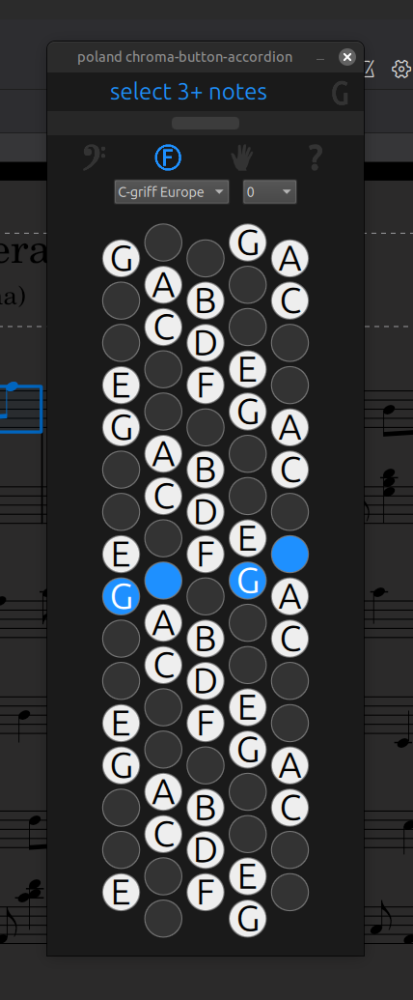
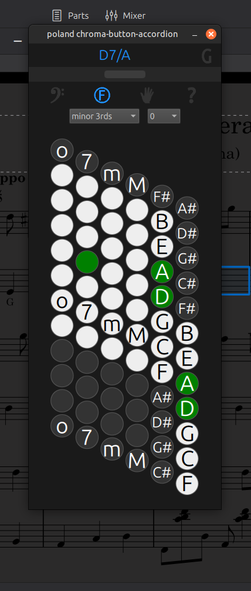
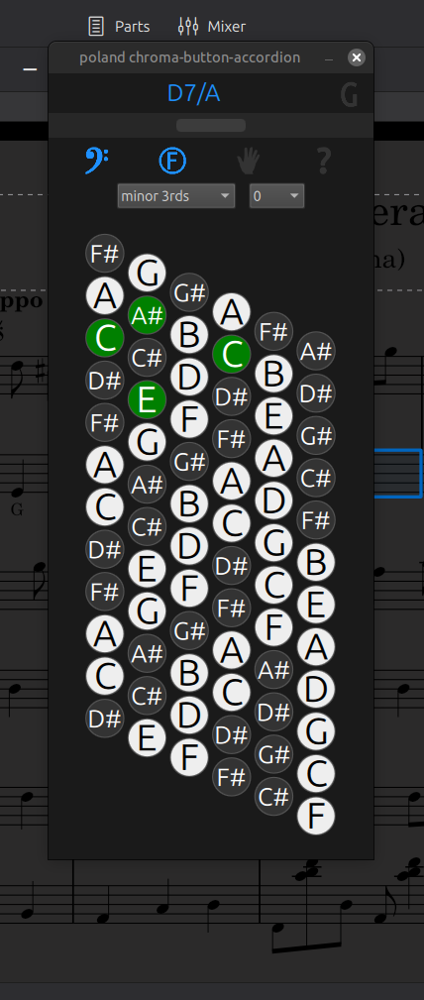

## **poland chroma-button-accordion**

mu4 plugin for chromatic button accordion

get visual help at first hours of knowing that magnificent instrument of yours

* *visual selected-notes-to-buttons presentation*
* *automatic chord identifier*
* *automatic selection of treble vs bass*
* *click-to-dock top or left*
* *collapsible window for minimal score clutter*
* ***buttonboards from player perspective***
* *6 treble & 5 bass layouts - modeled from poland fr 1 xb v-accordion*
* *dark theme - eyes & wallet friendly*
* ***0 (zero) carbon emission & 100 % recyclable***
* *multi-lingual : english | deutsch | français | español*

### **installation**

download the plugin folder or clone repository

unzip it into your musescore plugins directory, ie :
    
    windows: C:\Users\[your user name]\Documents\MuseScore4\Plugins\

    macOS: ~/Documents/MuseScore4/Plugins/

    linux: ~/Documents/MuseScore4/Plugins/

enable via plugin manager :

* in museScore > plugins > manage plugins (or home > plugins ...)
* select the plugin
* click enable

*made with mu4.7 & a lot of hasLove - includes manyAsleeplesNights potion*
*fair warning : **do not overuse***

### license

this project is licensed under the MIT license - see the LICENSE file for details

<table>
  <tr>
    <td></td>
    <td></td>
    <td></td>
  </tr>
  <tr>
    <td align="center">treble right</td>
    <td align="center">bass stradella</td>
    <td align="center">bass melodic / free bass</td>
  </tr>
</table>
